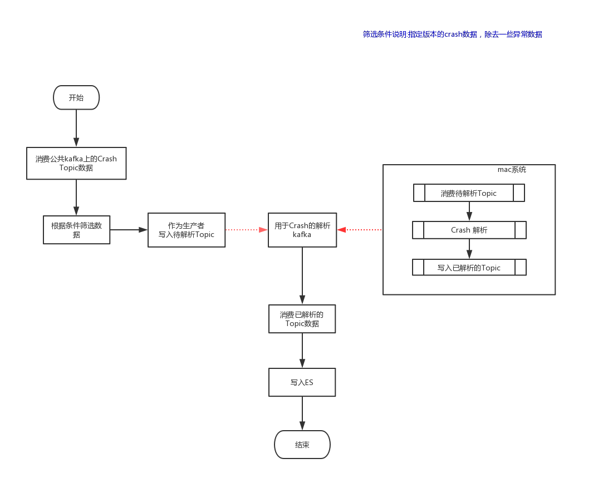

iOS Crash 持续解析方案
--------------------------------------
目的

1.实现Bugly相互备份的技术方案

2.对于一些敏感的App，不方便接入Bugly

3.从Bugly获取源数据不方便，如果需要对Crash数据做一些定制化的数据分析需求无法实现

思路

技术实现

1.golang做数据传递

2.使用ES存储，后续可以用于分析，kibana展示分析数据

3.Crash解析使 iOS symbolicatecrash 请参考-->https://github.com/kidzss/parseiOSCrash

4.Crash收集后使用PLCrashReport format

一起讨论

上述方案已经实现，可以一起讨论QQ：397027757
